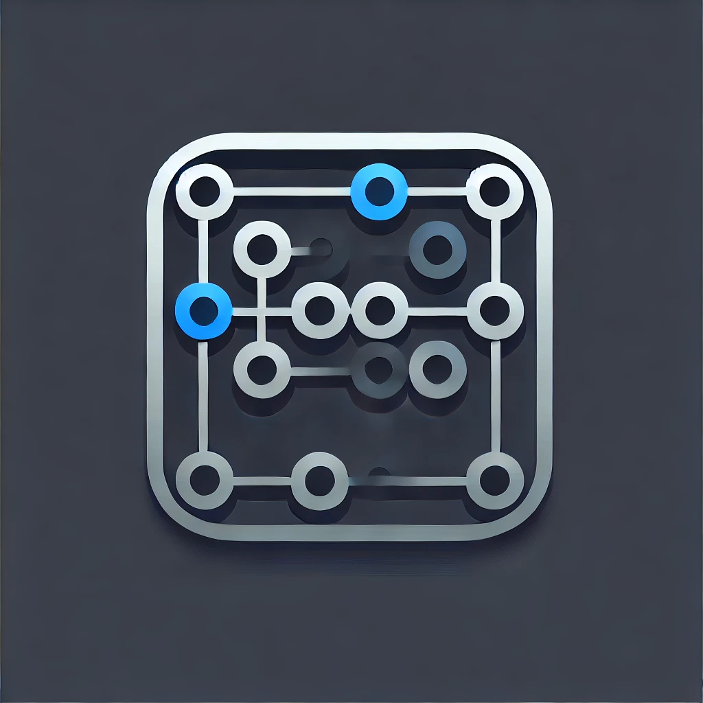

# Pattern Lock - Web Version



## Overview

This project is a 10+ web-based Pattern Lock interface, similar to the Android pattern lock screen. It allows users to create a pattern by dragging over a grid of circles. Each circle in the grid represents a node in the pattern, and lines are dynamically drawn to connect the nodes, giving a visual representation of the user’s selected pattern.

## Features

- **Pattern Tracking**: Users can draw a pattern by dragging over the circles in the grid.
- **Line Connectors**: Lines connect the circles as the user drags over them, showing the pattern path.
- **Real-time Pattern Logging**: The pattern is logged in the console as each circle is selected.
- **Reset After Completion**: Once a pattern is completed, the selection and lines are cleared automatically.
- **Cross-Device Compatibility**: Supports both mouse (desktop) and touch (mobile) events, making it accessible on both desktop and mobile devices.

## Demo

> Add a live demo link here:
> [index.html](pattern-lock-template.vercel.app)
> [1.html](https://pattern-lock-template.vercel.app/1.html)
> [2.html](https://pattern-lock-template.vercel.app/2.html)
> [best-animation-3.html](https://pattern-lock-template.vercel.app/best-animation-3.html)
> [alert-4.html](https://pattern-lock-template.vercel.app/alert-4.html)
> [Spacial-5.html](https://pattern-lock-template.vercel.app/Spacial-5.html)
> [jumping-6.html](https://pattern-lock-template.vercel.app/jumping-6.html)
> [glowing-boll-7.html](https://pattern-lock-template.vercel.app/glowing-boll-7.html)
> [diamond-8.html](https://pattern-lock-template.vercel.app/diamond-8.html)
> [neon-9.html](https://pattern-lock-template.vercel.app/neon-9.html)
> [3d-10.html](https://pattern-lock-template.vercel.app/3d-10.html)
> [gradient-ripple-11.html](https://pattern-lock-template.vercel.app/gradient-ripple-11.html)
> [retro-pixel-12.html](https://pattern-lock-template.vercel.app/retro-pixel-12.html)
> [13.html](https://pattern-lock-template.vercel.app/13.html)
> [14.html](https://pattern-lock-template.vercel.app/14.html)
> [15.html](https://pattern-lock-template.vercel.app/15.html)

## Technologies Used

- **HTML**: Provides the structure for the pattern lock grid.
- **CSS**: Adds styling to make the circles visually appealing and defines transitions and animations for the active circles and lines.
- **JavaScript**: Handles the functionality for pattern tracking, connecting lines, and resetting the pattern.

## How to Run

1. **Clone the Repository**:
   ```bash
   git clone https://github.com/yourusername/pattern-lock.git
   cd pattern-lock
   ```

2. **Open the `index.html` File**:
   Open `index.html` in any modern browser (Chrome, Firefox, Safari, Edge).

3. **Interact with the Pattern Lock**:
   - Draw a pattern by clicking and dragging over the circles in the grid.
   - Release the mouse or lift your finger to complete the pattern.
   - Observe the drawn pattern in the console and on-screen.

## Project Structure

- **index.html**: Contains the HTML structure for the pattern lock grid.

## Code Explanation

### HTML Structure

The HTML file defines a simple 3x3 grid of circles, each circle representing a node in the pattern lock interface.

```html
<div class="pattern-lock">
  <div class="circle" data-id="1"></div>
  <div class="circle" data-id="2"></div>
  <div class="circle" data-id="3"></div>
  <!-- Remaining circles up to 9 -->
</div>
```

Each circle has a `data-id` attribute, which helps track the sequence of selected circles.

### CSS Styling

The CSS file styles the grid and circles to resemble a pattern lock screen:

- `.pattern-lock`: Sets the grid layout and spacing.
- `.circle`: Styles each circle, providing a background color, size, and transition effect.
- `.circle.active`: Adds a different color and border effect when a circle is selected.
- `.line`: Dynamically generated elements connecting circles, using CSS transforms to rotate and position the lines.

### JavaScript Functionality

JavaScript is responsible for handling user interactions and managing the pattern state. Here’s a breakdown of key functions and logic:

#### 1. **Pattern Tracking**

The `startPattern` function records each selected circle’s ID in the `pattern` array and highlights the circle.

```javascript
const startPattern = (circle) => {
  if (!pattern.includes(circle.dataset.id)) {
    pattern.push(circle.dataset.id);
    circle.classList.add('active');
    console.log(`Selected: ${circle.dataset.id}`);
    
    if (pattern.length > 1) {
      const prevCircle = document.querySelector(`[data-id="${pattern[pattern.length - 2]}"]`);
      drawLine(prevCircle, circle);
    }
  }
};
```

#### 2. **Drawing Lines Between Circles**

The `drawLine` function creates a line element and positions it between two circles to show the connection:

```javascript
const drawLine = (startCircle, endCircle) => {
  const line = document.createElement('div');
  line.classList.add('line');

  const startX = startCircle.offsetLeft + startCircle.offsetWidth / 2;
  const startY = startCircle.offsetTop + startCircle.offsetHeight / 2;
  const endX = endCircle.offsetLeft + endCircle.offsetWidth / 2;
  const endY = endCircle.offsetTop + endCircle.offsetHeight / 2;

  const length = Math.hypot(endX - startX, endY - startY);
  const angle = Math.atan2(endY - startY, endX - startX) * (180 / Math.PI);

  line.style.width = `${length}px`;
  line.style.transform = `rotate(${angle}deg)`;
  line.style.left = `${startX}px`;
  line.style.top = `${startY}px`;

  patternLock.appendChild(line);
  lines.push(line);
};
```

#### 3. **Resetting the Pattern**

After the user completes a pattern, all selected circles and lines are cleared:

```javascript
const resetPattern = () => {
  pattern = [];
  circles.forEach(circle => circle.classList.remove('active'));
  lines.forEach(line => line.remove());
  lines = [];
};
```

#### 4. **Event Listeners**

The script attaches event listeners for `mousedown`, `mouseup`, `mouseenter`, and touch events to track the pattern across desktop and mobile devices.

```javascript
document.addEventListener('mouseup', () => {
  if (isMouseDown) {
    isMouseDown = false;
    console.log('Pattern:', pattern.join('-'));
    alert('Pattern: ' + pattern.join('-'));
    resetPattern();
  }
});
```

### Additional Notes

- **Cross-Device Compatibility**: The pattern lock uses both mouse and touch events to handle interactions on desktop and mobile browsers.
- **Customization**: You can easily customize the grid size, pattern validation, and visual effects by modifying the CSS and JavaScript files.

## Possible Improvements

1. **Pattern Validation**: Add a function to compare the user’s input pattern with a predefined pattern to lock/unlock certain actions.
2. **Customizable Grid Size**: Extend the code to create larger grids (e.g., 4x4 or 5x5) for a more complex pattern lock.
3. **Error Feedback**: Display feedback if the user’s pattern doesn’t match a preset pattern.

## Contributing

Feel free to fork this repository and submit pull requests if you have improvements or bug fixes. Suggestions for new features are also welcome!

---
